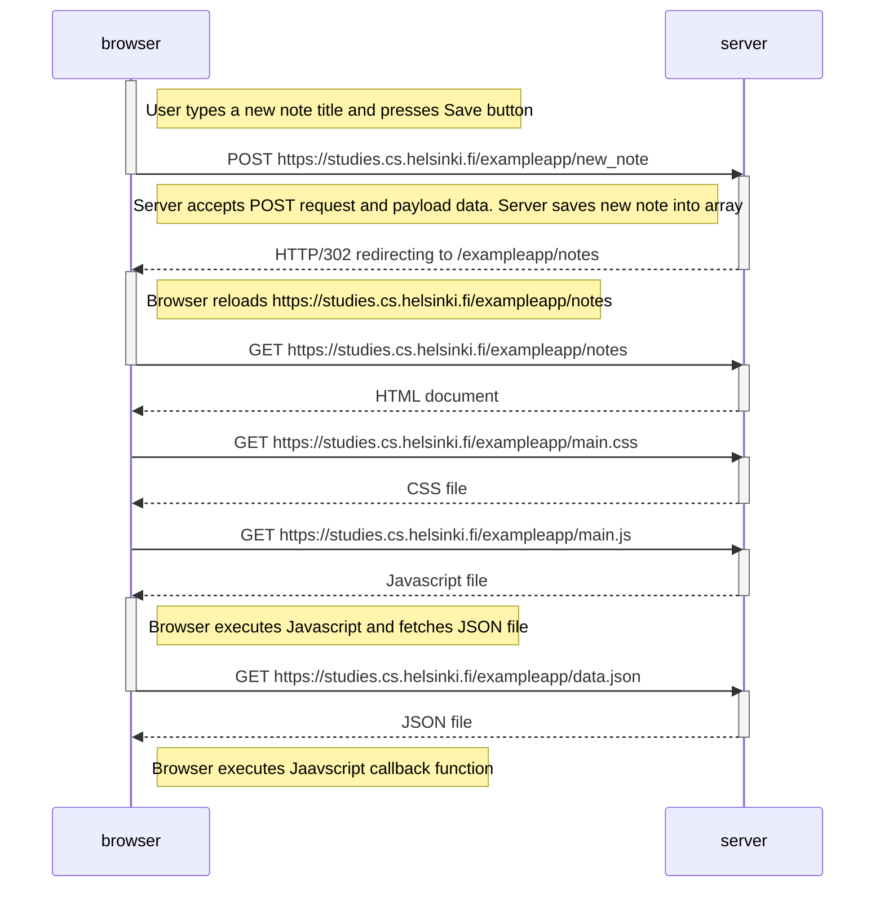

```mermaid
sequenceDiagram

    participant browser
    participant server

    activate browser
    note right of browser: User types a new note title and presses Save button
    browser->>server: POST https://studies.cs.helsinki.fi/exampleapp/new_note
    deactivate browser
    
    activate server
    note left of server: Server accepts POST request and payload data. Server saves new note into array
    server-->>browser: HTTP/302 redirecting to /exampleapp/notes
    deactivate server

    activate browser
    note right of browser: Browser reloads https://studies.cs.helsinki.fi/exampleapp/notes
    browser->>server: GET https://studies.cs.helsinki.fi/exampleapp/notes
    deactivate browser

    activate server
    server-->>browser: HTML document
    deactivate server

    browser->>server: GET https://studies.cs.helsinki.fi/exampleapp/main.css
    activate server
    server-->>browser: CSS file
    deactivate server

    browser->>server: GET https://studies.cs.helsinki.fi/exampleapp/main.js
    activate server
    server-->>browser: Javascript file
    deactivate server

    activate browser
    note right of browser: Browser executes Javascript and fetches JSON file
    browser->>server: GET https://studies.cs.helsinki.fi/exampleapp/data.json
    deactivate browser

    activate server
    server-->>browser: JSON file
    deactivate server

    note right of browser: Browser executes Jaavscript callback function
```