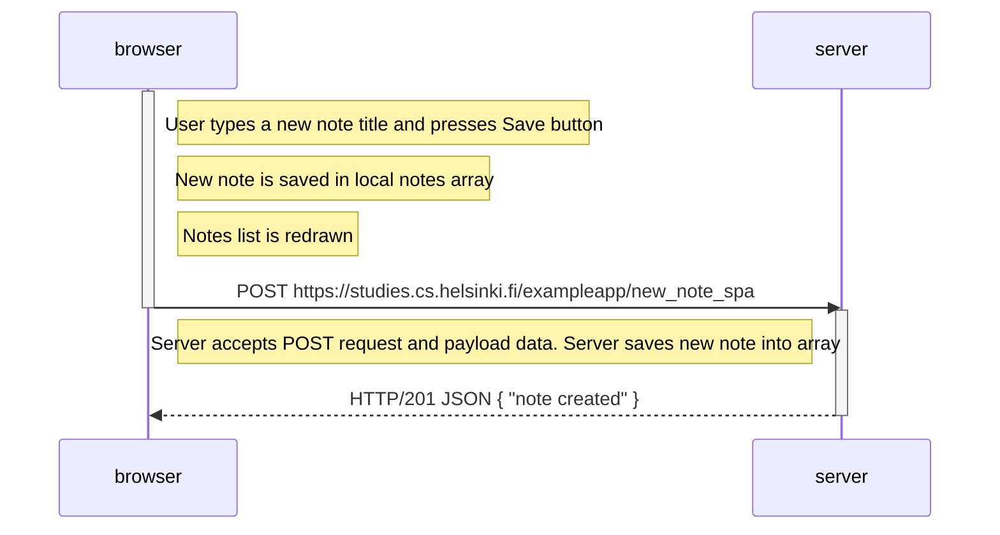

```mermaid
sequenceDiagram

    participant browser
    participant server

    activate browser
    note right of browser: User types a new note title and presses Save button
    note right of browser: New note is saved in local notes array
    note right of browser: Notes list is redrawn
    browser->>server: POST https://studies.cs.helsinki.fi/exampleapp/new_note_spa
    deactivate browser

    activate server
    note left of server: Server accepts POST request and payload data. Server saves new note into array
    server-->>browser: HTTP/201 JSON { "note created" }
    deactivate server
```